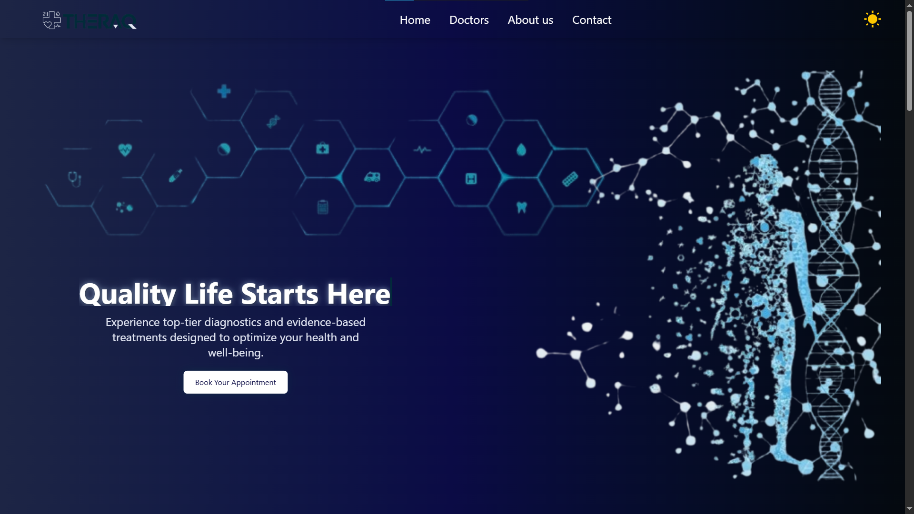
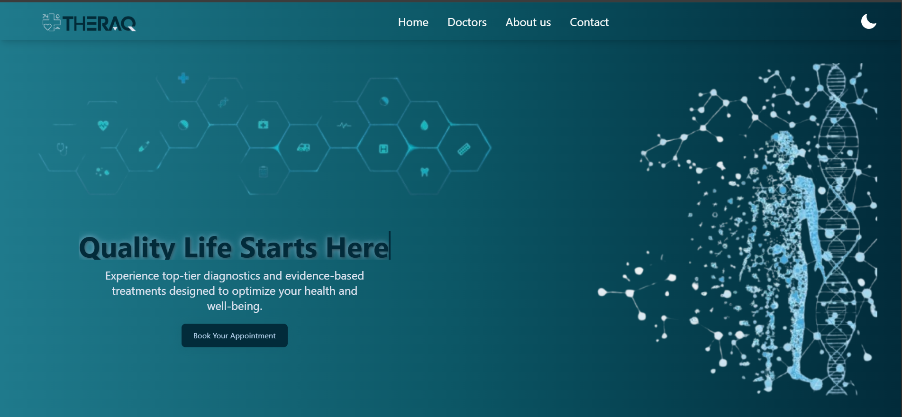

# 🩺 THERAQ – Appointment Scheduling Platform



THERAQ is a modern, responsive **appointment scheduling web application** designed to simplify the process of finding and booking appointments with healthcare professionals. Built with **React** and **Vite**, THERAQ provides an intuitive user experience by connecting patients with doctors based on **specialty, availability, and location**.

---

## 🌟 Features

- **Doctor Search** – Browse and filter doctors by specialty, name, or availability  
- **Appointment Booking** – Seamlessly schedule appointments with preferred healthcare providers  
- **Doctor Profiles** – View detailed doctor information, including bios, specialties, and patient reviews  
- **Responsive Design** – Optimized for desktop, tablet, and mobile devices  
- **Confirmation Flow** – Instant confirmation after successful appointment booking  
- **Static Content Pages** – Dedicated pages for About Us, Contact, and Reviews  

---

## 📁 Project Structure

```text
THERAQ/
├── doctors.json            # Static data source for doctor profiles
├── eslint.config.js        # ESLint configuration
├── index.html              # Main HTML entry point
├── package.json            # Project dependencies and scripts
├── vite.config.js          # Vite development & build configuration
├── public/
│   └── assets/
│       └── img/            # Static images (logo, UI graphics)
└── src/
    ├── App.jsx             # Root component (routing & layout)
    ├── main.jsx            # React application entry point
    ├── index.css           # Global styles
    ├── components/         # Reusable UI components
    │   ├── Footer.jsx
    │   ├── NavBar.jsx
    │   ├── SearchBar.jsx
    │   └── Sidebar.jsx
    └── pages/              # Application pages
        ├── Home.jsx
        ├── FindDoctor.jsx
        ├── BookAppointment.jsx
        └── Reviews.jsx
```

---

## 🛠️ Technologies Used

| Category   | Technology |
|-----------|------------|
| Framework | React (JSX) |
| Build Tool | Vite |
| Styling | Plain CSS |
| Linting | ESLint |
| Data Source | Static JSON (`doctors.json`) |

---

## 🚀 Getting Started

### Prerequisites

- Node.js **v18+** (recommended)
- npm (included with Node.js)

### Installation

1. **Clone the repository**
   ```bash
   git clone https://github.com/your-username/THERAQ.git
   cd THERAQ
   ```

2. **Install dependencies**
   ```bash
   npm install
   ```

3. **Start the development server**
   ```bash
   npm run dev
   ```

4. Open your browser and navigate to:  
   **http://localhost:5173** (or the port shown in the terminal)

---

## 🏗️ Build for Production

To create an optimized production build, run:

```bash
npm run build
```

The production-ready files will be generated in the **`dist/`** directory.

---

## ⚠️ Important Note

This is a **frontend-only prototype**.  
In a real-world application, doctor data, availability, and appointments would be managed using:
- A backend API  
- A database  
- Authentication & authorization  

---

## 📄 License

This project is intended for **educational and demonstration purposes**.  
There is no formal license — feel free to use, modify, or adapt it for personal or learning projects.

---

## ❤️ Acknowledgements

Made with ❤️ to improve access to healthcare.  

**THERAQ – Your health, your schedule.**
